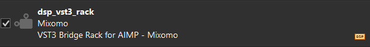

# VST3 Bridge Rack For AIMP

VST3 Bridge Rack For AIMP is a rack-only AIMP DSP plug-in. It hosts an ordered serial chain of up to ten VST3 effects and runs plug-in scanning, editors and audio processing outside `AIMP.exe`.

This branch is an independent rack product. It does not contain the single-plug-in bridge UI or a switch between single and rack modes.


## Highlights

- AIMP SDK v5.40 build 2650 integration, including AIMP's ASIO output path.
- Ordered serial rack with a maximum of ten VST3 effects.
- Native x86 and x64 AIMP DLLs, isolated hosts and isolated scanners in one `.aimppack`.
- Asynchronous shared-memory audio IPC: third-party VST3 code never runs inside `AIMP.exe`.
- Scrollable cards with embedded editors, Mute, Solo, reordering, cloning, replacing and per-slot state.
- Multiple embedded VST3 GUIs can remain expanded simultaneously.
- Detached and Full Screen presentations with fixed-size and growable-editor handling.
- Manual VST3 discovery with per-candidate process isolation, timeout, cache and quarantine.
- Versioned atomic JSON configuration with portable and user-profile storage.
- AIMP-inspired grey/orange interface, active-card highlighting, orange scrollbar and tooltips for every host control.

## Install

Download the `.aimppack` from the **Releases Page** or from [`dist/dsp_vst3_rack.aimppack`](dist/dsp_vst3_rack.aimppack) and install it through AIMP's plug-in manager, then select `VST3 Bridge Rack for AIMP - Mixomo` in AIMP's DSP selector.



The package contains both architectures:

```text
dsp_vst3_rack/
|-- dsp_vst3_rack_config.example.json
|-- bin/VST3RackHost32.exe
|-- bin/VST3RackHost64.exe
|-- bin/VST3RackScanner32.exe
|-- bin/VST3RackScanner64.exe
|-- x86/dsp_vst3_rack.dll
`-- x64/dsp_vst3_rack.dll
```

Portable VST3 bundles may be placed in `dsp_vst3_rack\VST3`. Other locations are added from **Scan Folders**. Discovery is manual for stability purposes; opening AIMP or the rack does not start a scan.

Closing the rack window only hides the interface. The active DSP chain remains loaded until it is disabled in AIMP.

## Rack Window

Audio flows from card `01` downward. Each card shows:

- rack position;
- VST3 name;
- company;
- class/category;
- complete `.vst3` bundle path.

The selected card uses a dark-orange background. The rack scrolls vertically and the bridge window is resizable.

### Global Controls

**+ Add VST** opens one menu with every compatible scanned VST3 and **Add VST...**, which scans one selected bundle before appending it.

**Card States...** contains **Expand all cards**, **Collapse all cards** and **Remove all cards**.

**Scan Folders** opens the saved discovery-location list.

**Settings** opens storage, startup, scan and maintenance options.

### Card Controls

| Control | Action |
|---|---|
| Arrow below the name | Expand or collapse this embedded VST3 GUI. |
| **M** | Mute this slot. Audio skips the VST3. |
| **S** | Solo this slot. When any Solo is active, non-solo slots are skipped. |
| **↑ / ↓** | Move the card one position. |
| Drag card | Reorder using the orange destination indicator. |
| **+** | Insert a scanned VST3 below this card, or use **Add VST...**. |
| **-** | Remove this card. |
| **Clone** | Clone above or below, including VST3 state, Mute, Solo and editor height. |
| **Replace...** | Replace in place from the scanned list or **Add VST...**. If loading fails, the previous VST3 and state are restored. |
| **Actions...** | Reload the instance, reset parameters, reveal the `.vst3`, open Detached/Full Screen, or forget the current plug-in type. Reload preserves state, Mute, Solo, position and editor height. |

All ten slots process in the displayed order. Reordering a card changes the real audio chain.

### Embedded Editors

Embedded GUIs are independent: expanding one card does not collapse the others. The orange bar below an expanded editor resizes that card only.

The safe minimum comes from the VST3/JUCE constraint when available; otherwise it uses the complete native editor height. This prevents one editor from overlapping the next card. The height is stored per slot.

Fixed editors stay at their native size and are centred in the card. Growable editors follow the card width and stored height. Unused canvas follows the active or inactive card colour.

### Detached Mode

Detached mode uses a dark JUCE title bar with the VST3 name centred and one close button.

- A genuinely fixed editor is attached directly as the window content. The window is exactly the VST3 width and the VST3 height plus the 30-pixel title bar; no host canvas is added.
- A genuinely growable editor uses the comfortable-size calculation from the `main` branch. It preserves monitor aspect ratio and converts physical targets through the Windows display scale:
  - 1920×1080 display → 1280×720 physical target;
  - 2560×1440 display → 1920×1080 physical target;
  - 3840×2160 display → 2560×1440 physical target;
  - ultrawide displays retain their aspect ratio.

The host probes the VST3 size constrainer without changing the GUI. Plug-ins that report `isResizable()` but cannot actually grow are treated as fixed.

### Full Screen Mode

Full Screen hides the rack and host title bar.

- Fixed editors remain at native size and are centred on an opaque dark canvas.
- Growable editors receive the complete monitor bounds. The host reapplies those bounds periodically, matching the working fullscreen mechanism from the `main` branch.

`Esc` or `F11` closes Detached or Full Screen completely and returns to the rack. Pressing `F11` while the rack is focused opens the selected card in Full Screen.

## Keyboard Navigation

The four arrow keys select the previous or next rack GUI, wrapping at the ends. Keyboard navigation intentionally leaves only the destination GUI expanded. Manual expansion still allows multiple GUIs to remain open.

## Scanning And Architecture


**Scan Folders** provides:

- **Add Folder** — save another recursive VST3 location;
- **Remove** — forget the selected location without deleting plug-ins or files;
- **Scan All** — scan all saved and enabled locations;
- **Cancel** — stop after the candidate currently being inspected finishes or is terminated.

Every VST3 candidate runs in its own scanner process. Crashes and timeouts therefore do not take down AIMP or the audio host. Scan failures and runtime failures are cached and quarantined until reset or rescanned.

The package includes x86 and x64 helpers. One running rack cannot mix x86 and x64 VST3 instances in the same serial chain. When the rack is empty, selecting a plug-in of the other architecture can restart the isolated helper in the required architecture.

## Settings


### Storage

- **Automatic** — use a writable local configuration when a local config, portable marker or portable AIMP profile is detected; otherwise use AppData.
- **Portable** — store `dsp_vst3_rack_config.json` beside the rack, falling back to AppData if the directory is not writable.
- **User profile** — store the configuration in the current Windows user's AppData tree.

Changing storage mode migrates current rack settings, known plug-ins and states to the new location.

### Startup

- **Restore rack** — restore cards, order, VST3 state, Mute, Solo and editor height.
- **Start with empty rack** — start without cards while retaining scanned plug-ins.
- **Open rack window with AIMP** — show the rack when AIMP starts this DSP. Disabled by default.

Window geometry and Detached/Full Screen state are not persisted.

### Scan Sources

- **Include rack folder when scanning** includes the package and portable `VST3` location.
- **Include system VST3 folders** includes standard Windows Common Files VST3 locations.

### Maintenance

- **Open Log** opens the current process log.
- **Open Config Folder** opens the active configuration directory.
- **Copy Diagnostics** copies rack, architecture, path and plug-in information without opaque Base64 state.
- **Reset Scan Cache** clears fingerprints and quarantine while preserving the rack, known plug-ins and saved states.
- **Forget All Plugins** clears the rack and scanned list. It never deletes `.vst3` files.

Each card also has **Forget current plugin**, which removes that VST3 type and all of its rack instances without deleting the bundle.

## State And Configuration

Configuration schema `9` stores up to ten independent rack slots. Each slot includes:

- normalised VST3 bundle reference;
- opaque VST3 state;
- Mute and Solo values;
- embedded editor height.

Clones of the same plug-in therefore remain independent. Parameters, presets, GUI scale and external-resource references are restored only when the VST3 itself serialises them.

Paths inside the bridge, AIMP or portable profile trees are stored relatively where possible. External paths remain absolute. Writes use a temporary file, backup, process lock and atomic replacement.

## Build

Requirements: Windows 10/11, Visual Studio 2022 with the C++ desktop workload, CMake 3.22 or newer, and Windows PowerShell. JUCE and the AIMP SDK are vendored under `third_party`.

Build, test, validate and package x86/x64:

```powershell
powershell -ExecutionPolicy Bypass -File .\Build-All.ps1
```

Build one architecture:

```powershell
cmake -S . -B build_x64 -G "Visual Studio 17 2022" -A x64
cmake --build build_x64 --config Release
ctest --test-dir build_x64 -C Release --output-on-failure
```

The resulting installer is `dist/dsp_vst3_rack.aimppack`.

## Diagnostics

Logs are isolated per installation, architecture and process under `%TEMP%`, with names similar to:

```text
%TEMP%\dsp_vst3_rack_<instance>_x64_<pid>.log
```

The startup recovery check can be run manually:

```powershell
$exe = 'C:\Program Files\AIMP\Plugins\dsp_vst3_rack\bin\VST3RackHost64.exe'
$p = Start-Process $exe -ArgumentList '--smoke-test-startup' -PassThru
if (-not $p.WaitForExit(5000)) { $p.Kill(); 'FAILED: startup timed out' } else { "Exit code: $($p.ExitCode)" }
```

A failed recovery check starts the bridge in dry bypass and reports a warning without silently replacing saved VST3 state.

## Limitations

- Universal VST3 compatibility is not possible. Some plug-ins require DAW-specific transport, MIDI, sidechains, licensing services or GPU/WebView behavior.
- A single rack chain cannot mix x86 and x64 VST3 instances.
- Legacy system-DPI editors can remain imperfect on mixed-DPI systems. Scale-aware VST3/JUCE editors behave best.
- A host can restore only data serialised by the VST3.
- The asynchronous pipeline adds latency so AIMP's audio callback never waits for another process.
- Very high CPU or DPC latency can still starve the isolated host; bypass protects continuity but cannot create CPU time.

## Licensing And Credits

VST3 Bridge Rack For AIMP is licensed under GPL-3.0. See [`LICENSE`](LICENSE).

Vendored dependencies retain their own licences:

- JUCE modules: AGPLv3 or a commercial JUCE 8 licence; see `third_party/JUCE/LICENSE.md`.
- Steinberg VST3 SDK distributed by JUCE: MIT; see its vendored `LICENSE.txt`.
- AIMP SDK: see the files under `third_party/aimp-sdk`.

Without a commercial JUCE licence, JUCE use is governed by AGPLv3. Review all vendored licences before redistribution.

Developed by Ezequiel Casas (Mixomo): <https://github.com/Mixomo>
