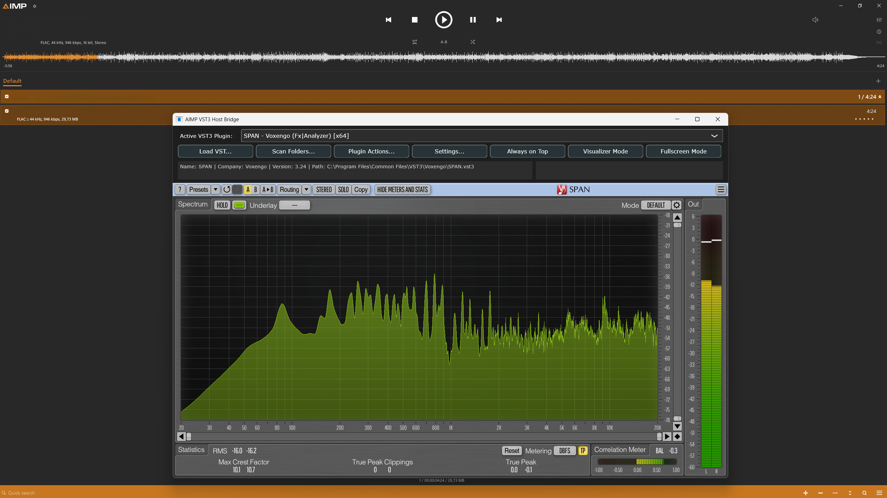
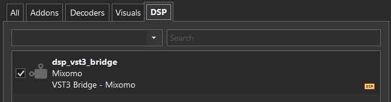
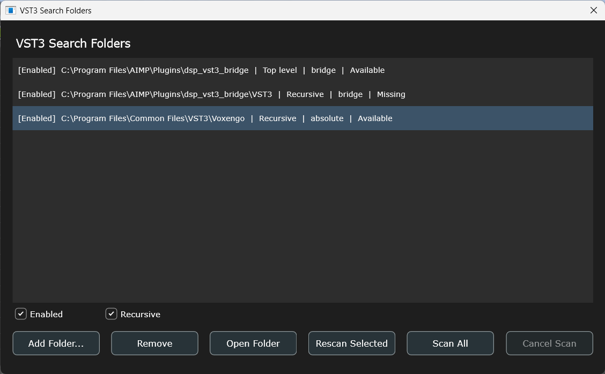
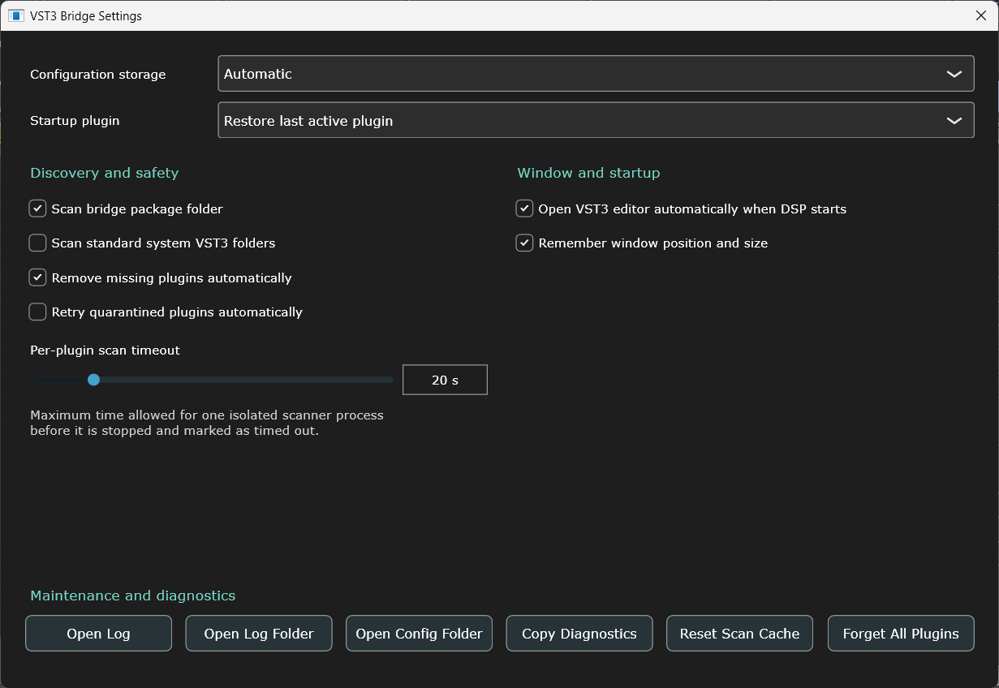

# VST3 Bridge for AIMP

VST3 Bridge for AIMP hosts a VST3 effect in AIMP's DSP pipeline, including ASIO output. Third-party VST3 code, audio processing, scanning and editors run outside `AIMP.exe`



## Features

- AIMP SDK v5.40 build 2650 integration.
- One active VST3 effect at a time, with asynchronous shared-memory audio IPC.
- Native x86 and x64 AIMP DLLs, hosts and scanners in one package.
- Mixed-bitness hosting: either AIMP architecture can restart the isolated x86 or x64 host required by the selected plug-in.
- Manual discovery in the bridge package, its `VST3` folder, custom folders and optional standard-system folders.
- One crash-isolated scanner process per VST3, with timeout, cache and separate scan/runtime quarantine.
- Manual `Load VST3...` remains available and uses the isolated scanner.
- Versioned atomic JSON configuration with portable, user-profile and automatic storage modes.
- Relative path references for bridge, AIMP and profile content, including adjacent portable folders.
- Last-active or bypass startup behavior, with independent VST3 state restoration for every remembered plugin.
- Normalised VST3 bundle paths, including JUCE plug-ins that report their internal platform binary instead of the bundle root.
- Optional automatic editor opening.
- Generic visualizer and fullscreen modes, always-on-top and remembered window geometry per bridge installation.
- Separate parameter/state and window-size resets. Window sizing is monitor-, aspect-ratio- and DPI-aware and remains a manual action, so switching VST3 plug-ins does not overwrite the user's persisted geometry.
- Per-Monitor DPI Awareness manifests for all hosts and scanners. JUCE handles live per-monitor scale changes and forwards supported VST3 editor scaling/resizing requests.
- Per-installation, per-architecture and per-process logs in `%TEMP%`.

## Install

Download the `.aimppack` from the **Releases Page** or from [`dist/dsp_vst3_bridge.aimppack`](dist/dsp_vst3_bridge.aimppack) and install it through AIMP's plug-in manager, then select `VST3 Bridge - Mixomo` in AIMP's DSP selector.

The combined package contains:

```text
dsp_vst3_bridge/
|-- x64/dsp_vst3_bridge.dll
|-- x86/dsp_vst3_bridge.dll
|-- bin/VST3BridgeHost64.exe
|-- bin/VST3BridgeHost32.exe
|-- bin/VST3BridgeScanner64.exe
|-- bin/VST3BridgeScanner32.exe
`-- dsp_vst3_bridge_config.example.json
```

Place portable VST3 bundles in `dsp_vst3_bridge\VST3`, or use **Scan Folders...** and scan from that window. The bridge never scans automatically for stability purposes. Closing the bridge window hides it; it does not unload the active processor.

## Bridge Controls

### AIMP DSP Selector



Select **VST3 Bridge - Mixomo** in AIMP's DSP selector to insert the bridge into AIMP's audio pipeline. This processes audio before it reaches the selected output device, including ASIO. Selecting **[Disabled]** in AIMP removes the complete bridge from the DSP path.

The bridge itself also has a **[None - Bypass]** entry. This leaves the bridge enabled and its window available, but passes audio through without loading a VST3 processor.

### Main Window

**Active VST3 Plugin** selects the one VST3 that processes audio. Before a change, the bridge requests and saves the outgoing plug-in's state. It then loads the selected plug-in and restores that plug-in's own last saved state. Selecting **[None - Bypass]** unloads the current processor and passes audio through unchanged.

Each dropdown entry can contain the plug-in name, company, category, architecture and compatibility status. The category is shown only when the VST3 exposes it. The architecture indicates the helper required by the plug-in; the bridge can restart in its x86 or x64 helper even when AIMP itself uses the other architecture.

**Compatible** means the isolated scanner accepted the VST3. **Scan failed** means validation returned an error or malformed result. **Timed out** means validation exceeded the configured limit. **Wrong architecture** means the required scanner or host cannot handle the bundle. **Missing** means the remembered bundle is no longer present at its resolved path. **Runtime failed** means the plug-in passed discovery but later failed while loaded or processing; it remains isolated from AIMP and enters quarantine.

**Load VST...** selects one `.vst3` bundle. The bridge validates it in a separate scanner process, adds it to the dropdown and loads it when validation succeeds. This command never scans the containing folder.

**Scan Folders...** opens the manual discovery window. Search locations can be added, enabled and scanned from there. Opening this window does not start a scan.

**Plugin Actions...** opens operations for the currently selected entry. Parameter reset, size reset, retry, file location and removal are kept here so they cannot be triggered accidentally.

**Settings...** opens configuration storage, startup, discovery, window, maintenance and diagnostic options. The Settings and bridge windows remain independent and can be moved, resized and focused separately.

**Always on Top** keeps the bridge above ordinary windows. It does not force focus over file choosers or other dialogs. The preference is persisted.

**Visualizer Mode** hides the bridge controls and leaves the VST3 editor with a minimal dark title bar. The window remains movable and resizable. Press `Escape` to return to the normal bordered window.

**Fullscreen Mode** enters true borderless fullscreen visualizer mode on the current monitor. `F11` toggles this mode from anywhere in the bridge. Press `Escape` to leave it.

The **plug-in information line** shows the selected VST3's full name, company, version and normalised bundle path. The **status line** reports loading, scanning, recovery and failure progress. Hover either line to read text that does not fit in the compact layout.

The **editor canvas** contains the native VST3 GUI. Resizable editors are fitted to the available canvas and receive supported VST3 resize and scale requests. Fixed-size editors retain their requested dimensions and are centred when smaller than the canvas. The bridge constrains oversized editors to the usable monitor area so its controls remain reachable.

The native title bar provides **Minimise**, **Maximise/Restore** and **Close**. Closing the window only hides it; it does not unload the active plug-in or disable audio processing. Reopening AIMP's DSP preferences brings the existing bridge window to the front.

### Plugin Actions

**Plugin Actions...** applies only to the selected VST3. Actions that require a running instance are enabled only for the active plug-in.

**Retry and reset quarantine** appears for a failed, timed-out or quarantined entry. It clears that entry's scan and runtime failure flags, scans it again in isolation and loads it only if the new validation succeeds.

- **Reset Parameters** destroys and recreates the active instance without applying its saved bridge state. This resets exposed parameters and opaque plug-in state that a fresh instance clears.
- **Reset Size** changes only the bridge window. It chooses a comfortable resolution tier below the monitor's physical resolution, preserves the monitor aspect ratio, converts through the active Windows DPI scale, respects the usable desktop area and keeps the normal 1050-pixel logical minimum whenever it fits. Typical 100% examples are 1920x1080 to 1280x720, 2560x1440 to 1920x1080, and 3840x2160 to 2560x1440.
- **Open file location** opens the directory containing the normalised `.vst3` bundle.
- **Forget** removes the entry and its saved state. It can be rediscovered by a later manual scan.

Changing the active VST3 does not invoke **Reset Size**. The remembered bridge geometry and each plug-in's serialised state, including GUI scale when provided by the plug-in, remain independent.

### Search Folders



The **VST3 Search Folders** list displays each saved location with its enabled state, resolved path, traversal mode, path-reference base and current availability. Path-reference bases such as bridge, AIMP, profile or absolute allow portable locations to keep working after the package is moved.

**Enabled** includes the selected location in **Scan All**. Disabling it keeps the folder in the configuration but skips it during a full manual scan.

**Recursive** searches the selected folder and all of its subfolders. Disable it to inspect only `.vst3` bundles directly inside that folder.

**Add Folder...** adds a new manual discovery location. Duplicate canonical paths are ignored.

**Remove** forgets the selected search location. It does not remove already discovered plug-ins from the main dropdown and does not delete anything from disk.

**Open Folder** opens the selected location in Windows File Explorer.

**Rescan Selected** scans only the selected folder with its current recursive setting.

**Scan All** scans every enabled location. While a scan is running, this button is disabled and reads **Scanning...**.

**Cancel Scan** requests cancellation after the plug-in currently being inspected finishes or is terminated. It keeps this label and remains disabled while no scan is running.

Every candidate is scanned in its own process. A crash therefore ends that scanner rather than AIMP or the audio host. If one candidate exceeds the configured per-plugin timeout, the bridge terminates it, records a timeout, skips it and continues with the next candidate. The final status reports completed, compatible, failed and timed-out totals.

Discovery is always manual for stability purposes. Neither AIMP startup, opening the bridge nor editing the folder list starts a scan.

### Settings



#### Configuration Storage

**Automatic** selects a writable local configuration when a local config, portable marker or portable AIMP profile is detected. Otherwise it uses the Windows user profile.

**Portable** stores the JSON configuration beside the bridge. If that location is not writable, the bridge falls back to the user profile instead of losing changes.

**User profile** stores configuration under the current user's AppData tree. This is appropriate for a normal installed AIMP setup and keeps each Windows account independent.

Changing the storage mode migrates the current settings, known plug-ins and saved states to the new active configuration location.

#### Startup Plugin

**Restore last active plugin** attempts to load the last selected VST3 and restore its saved state when the DSP starts.

**Start with no plugin** always starts in **[None - Bypass]**. Remembered entries and their states remain available for later selection.

If startup recovery cannot safely restore the previous configuration or helper, the bridge opens in bypass and reports a recovery warning. The stored selection and plug-in state are not silently overwritten by that fallback.

#### Discovery And Safety

**Scan bridge package folder** includes the installed bridge directory and its adjacent portable `VST3` directory in a later manual scan.

**Scan standard system VST3 folders** includes the standard Windows Common Files VST3 locations in a later manual scan.

**Remove missing plugins automatically** removes dropdown entries whose bundle no longer exists when scan results are refreshed. It never deletes VST3 files.

**Retry quarantined plugins automatically** allows later manual discovery to reconsider entries previously isolated after a scan or runtime failure. The explicit **Retry and reset quarantine** action remains available for one selected entry.

**Per-plugin scan timeout** sets the maximum lifetime of each isolated scanner from 1 to 120 seconds. The default is 20 seconds. Increase it only for plug-ins that legitimately initialise slowly; a finite timeout prevents one frozen scanner from blocking the rest of the scan.

#### Window And Startup

**Open VST3 editor automatically when DSP starts** asks the helper to show the bridge window when AIMP activates the DSP. Startup recovery still takes precedence and can open safely in bypass.

**Remember window position and size** persists bridge position, dimensions, monitor, DPI, visualizer/fullscreen state and always-on-top preference. Plug-in changes do not force a size reset.

#### Maintenance And Diagnostics

**Open Log** opens the diagnostic log for the current bridge process in the associated text editor.

**Open Log Folder** opens the Windows temporary directory containing the current log.

**Open Config Folder** opens the directory containing the active JSON configuration. Its location follows the selected Automatic, Portable or User profile storage mode.

**Copy Diagnostics** copies bridge version, architecture, paths, DPI, window state, plug-in status and quarantine counts to the clipboard. Opaque Base64 VST3 state is intentionally omitted.

**Reset Scan Cache** invalidates saved scan fingerprints and clears scan/runtime quarantine flags. It keeps the dropdown, per-plugin states, scan folders and bridge settings, and it does not start a scan automatically.

**Forget All Plugins** unloads the active VST3 and clears every remembered dropdown entry and saved per-plugin state. Scan folders and general bridge settings remain intact. No VST3 file is deleted.

### State And Persistence

The bridge stores one opaque VST3 state for each remembered plug-in, not one global preset. Parameters, loaded presets, internal resources and GUI scale are restored only when the plug-in includes them in its VST3 state. Data that a plug-in keeps solely in external files or does not serialise cannot be reconstructed by the bridge.

State is saved when switching plug-ins, closing the bridge, changing relevant settings and during normal shutdown. Bundle paths are normalised to the `.vst3` root, even when a plug-in reports an internal platform binary. Paths inside the bridge, AIMP or profile trees are stored relatively where possible; external-volume paths remain absolute.

**Reset Parameters** replaces only the active plug-in's saved state with the state of a fresh instance. **Reset Size** changes only bridge geometry. **Forget** removes one plug-in and its state. **Forget All Plugins** removes every plug-in and state. **Reset Scan Cache** removes none of them.

### Keyboard Shortcuts

`F11` enters or exits fullscreen visualizer mode.

`Escape` exits fullscreen or visualizer mode and restores the normal bordered window.

## Configuration And Migration

**Automatic** uses a writable local configuration when a local config, `dsp_vst3_bridge.portable` marker, or portable AIMP profile tree is detected; otherwise it uses an isolated AppData directory. **Portable** keeps settings beside the bridge and falls back to AppData if unwritable. **User profile** always uses AppData.

Existing `activePluginPath`, saved state, known plug-ins, internal VST3 binary paths and legacy window bounds are migrated to configuration schema 7. Writes use a temporary file, backup, process lock and atomic replace. Local plug-in and scan-folder paths become portable references where possible; external-volume paths remain absolute. Each remembered plug-in stores its own opaque VST3 state.

## Build

Requirements: Windows 10/11, Visual Studio 2022 C++ desktop workload, CMake 3.22 or newer, and Windows PowerShell. JUCE and the AIMP SDK are vendored under `third_party`.

Build, test, validate manifests and package both architectures. The script stops on the first CMake, compiler or test failure and will not package stale binaries:

```powershell
powershell -ExecutionPolicy Bypass -File .\Build-All.ps1
```

For one architecture only:

```powershell
cmake -S . -B build_x64 -G "Visual Studio 17 2022" -A x64
cmake --build build_x64 --config Release
ctest --test-dir build_x64 -C Release --output-on-failure
```

## Diagnostics

Settings provides **Open Log**, **Open Log Folder**, **Copy Diagnostics**, and **Reset Scan Cache**. Logs use names similar to:

```text
%TEMP%\dsp_vst3_bridge_<instance>_x64_<pid>.log
```

Diagnostics omit the Base64 VST3 state. A failed or frozen scanner is terminated independently. A runtime plug-in failure immediately leaves the audio path in dry bypass.

The startup recovery check can also be run manually against an installed bridge:

```powershell
$exe = 'C:\Program Files\AIMP\Plugins\dsp_vst3_bridge\bin\VST3BridgeHost64.exe'
$p = Start-Process $exe -ArgumentList '--smoke-test-startup' -PassThru
if (-not $p.WaitForExit(5000)) { $p.Kill(); 'FAILED: startup timed out' } else { "Exit code: $($p.ExitCode)" }
```

At runtime the DLL performs this check in an isolated process. Failure or timeout starts the real bridge in bypass and displays a recovery warning without replacing the saved plug-in selection or state.

## Limitations

- Universal VST3 compatibility is not possible; some plug-ins assume DAW transport, MIDI, sidechains, licensing services or host-specific behavior.
- Legacy system-DPI editors can remain imperfect on mixed-DPI systems. The bridge does not bitmap-stretch them; scale-aware VST3/JUCE editors behave best.
- A host can preserve and restore only state that the VST3 serialises. Plug-in-specific GUI scale or external resources that are omitted from VST3 state remain the plug-in's responsibility.
- A two-block asynchronous pipeline adds latency so AIMP's audio callback never waits for another process.
- Very high CPU/DPC latency can still starve AIMP or the isolated host; bypass protects continuity but cannot create CPU time.
- Physical mixed-monitor, unusual GPU/WebView editor and commercial licensing behavior must be validated on the target system.
- Plug-in files, licenses and external services are not made portable by storing bridge paths relatively.

## Licensing

VST3 Bridge for AIMP is licensed under GPL-3.0. See [`LICENSE`](LICENSE).

Vendored third-party code retains its own license:

- JUCE framework modules: AGPLv3 or a commercial JUCE 8 license. See `third_party/JUCE/LICENSE.md`.
- JUCE examples: ISC. See `third_party/JUCE/LICENSE.md`.
- Steinberg VST3 SDK bundled by JUCE: MIT; see its vendored `LICENSE.txt`.
- AIMP SDK: see the files and documentation under `third_party/aimp-sdk`.

Build/tooling credits:

- Microsoft MSVC / Visual Studio C++ toolchain: https://microsoft.com/
- C++ language created by Bjarne Stroustrup.

Review all vendored licenses before redistribution. Without a commercial JUCE license, JUCE use is governed by AGPLv3.

### Credits:

Developed by Ezequiel Casas (Mixomo): https://github.com/Mixomo
